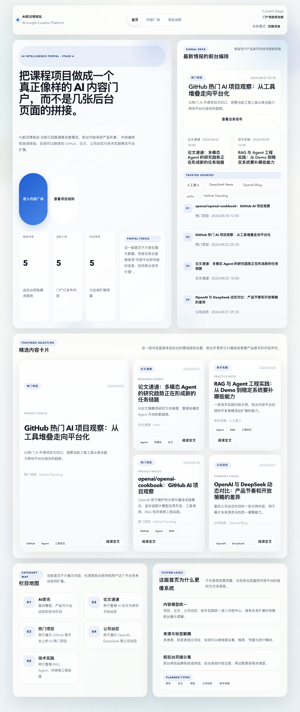
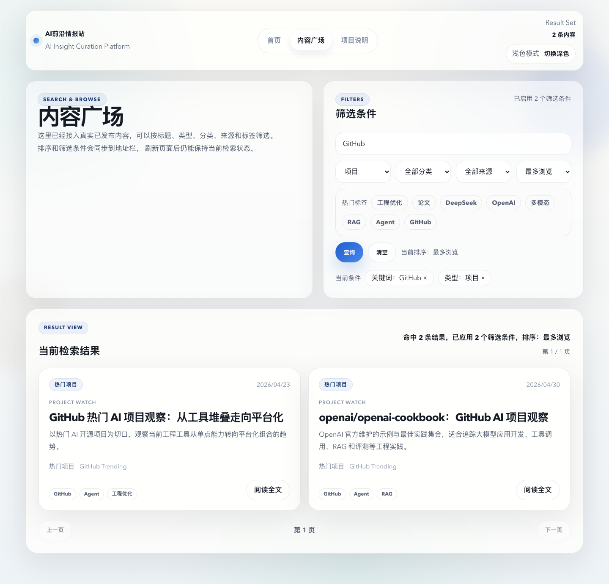
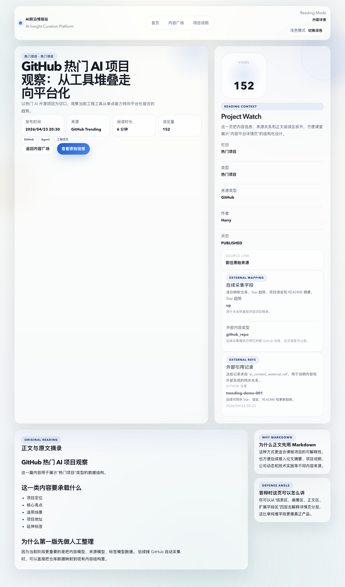
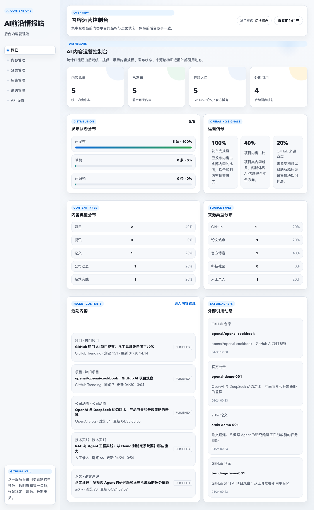
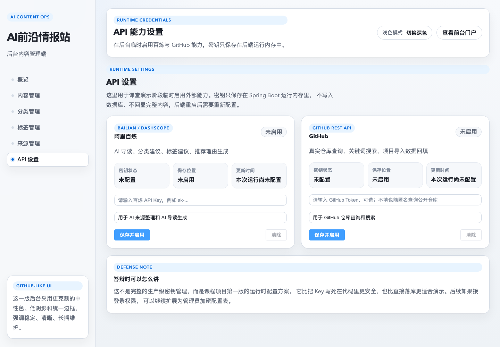

# AI Frontier Station

AI Frontier Station（AI前沿情报站）是一个面向 AI 开发者的前沿信息聚合与精选平台。项目当前形态是一个完整的 Vue + Spring Boot + MySQL 前后端分离 Web 系统，后续目标是持续扩展为支持 GitHub、论文、官方动态、技术社区与大模型 API 总结的信息发现平台。

GitHub: https://github.com/Harry6400/ai-frontier-station

这个项目最初来自课程大作业，但设计时刻意避免“普通管理系统”套路：它围绕 AI 内容源、外部引用、标签体系、AI 导读、GitHub API 和百炼 API 能力开关来构建，适合作为 AI Builder / AI information platform 的开源原型。

## Highlights

- 前台门户：内容首页、内容发现页、详情页、浅色/深色主题、搜索筛选、AI 导读展示。
- 后台管理：内容、分类、标签、来源、外部引用、Dashboard 统计、GitHub 项目导入、AI 来源整理。
- API 设置页：在后台网页中配置百炼、MiMo 和 GitHub Token，密钥使用 AES-256-GCM 加密后保存。
- GitHub API：支持真实仓库查询、关键词搜索、候选仓库回填、导入为平台内容。
- AI 总结层：支持阿里百炼 / DashScope 与 MiMo Provider，生成 AI 导读、推荐理由、标签建议和重要性评分。
- 论文数据源：支持 arXiv 搜索导入和 HuggingFace Daily Papers 导入。
- 后台安全：管理员 JWT 登录保护后台管理接口，前台门户继续公开访问。
- 安全展示：Markdown 渲染通过 DOMPurify 清洗，外部内容不直接信任。
- 可答辩文档：`docs-learning` 保存阶段记录、技术解释、答辩问答和后续路线。

## Screenshots

以下截图来自本地真实运行项目，用于 GitHub 开源展示、课程答辩和 MiMo Orbit 申请材料。

### Portal Home



### Content Discovery



### Content Detail With AI Guide



### Admin Dashboard



### API Settings



## Architecture

```text
AI Frontier Station
├─ frontend-portal   Vue 3 前台门户
├─ frontend-admin    Vue 3 + Element Plus 后台管理端
├─ backend           Spring Boot 3 + MyBatis-Plus 后端接口
├─ database          MySQL 建表与初始化脚本
└─ docs-learning     中文学习文档与阶段复盘
```

核心数据流：

```text
GitHub / 官方博客 / 论文 / 社区来源
        ↓
后台人工确认或 API 查询
        ↓
AI 总结层（百炼，可选）
        ↓
ai_content + ai_content_external_ref + extra_json
        ↓
前台门户展示与后台运营
```

## Tech Stack

- Frontend Portal: Vue 3, Vite, Vue Router, Pinia
- Admin Console: Vue 3, Vite, Vue Router, Pinia, Element Plus
- Backend: Spring Boot 3, MyBatis-Plus, Java 17
- Database: MySQL 8
- AI / Data APIs: Alibaba Bailian / DashScope, MiMo, GitHub REST API, arXiv, HuggingFace Papers
- Security: JWT admin authentication, encrypted API credentials, DOMPurify Markdown sanitization

## Feature Progress

- 已完成内容中心 CRUD、分类、标签、来源管理。
- 已完成前台内容展示、详情页、搜索、筛选、排序和主题切换。
- 已完成后台 Dashboard 统计、深色模式、包体优化和同构预览。
- 已完成 GitHub 项目手动导入与真实 GitHub API 查询/搜索。
- 已完成 AI 来源整理工作台，可选择百炼或 MiMo 生成导读和推荐理由。
- 已完成后台 API 设置页，可在网页中启用百炼、MiMo 和 GitHub 能力，密钥加密落库。
- 已完成管理员登录、arXiv 论文导入和 HuggingFace Daily Papers 导入。
- 待扩展：GitHub 热度同步、百炼联网搜索、订阅与周报、角色权限、部署上线。

## Quick Start

### 1. Prepare Database

Create and initialize the MySQL database:

```bash
mysql -uroot -p < database/schema.sql
mysql -uroot -p ai_frontier_station < database/init-data.sql
```

Optional environment variables:

```bash
export DB_URL='jdbc:mysql://localhost:3306/ai_frontier_station?useUnicode=true&characterEncoding=utf-8&serverTimezone=Asia/Shanghai'
export DB_USERNAME='root'
export DB_PASSWORD='your_mysql_password'
export JWT_SECRET='replace-with-a-long-random-secret'
export API_MASTER_KEY='replace-with-32-bytes-or-longer-random-secret'
```

You can also copy `.env.example` as a reference. Do not commit a real `.env` file.

After running `database/init-data.sql`, the local demo admin account is:

- Username: `admin`
- Password: `admin123`

This account is only for local coursework demonstration. Change it before any real deployment.

### 2. Start Backend

```bash
cd backend
mvn spring-boot:run
```

Backend URL: `http://localhost:8080`

### 3. Start Frontend Portal

```bash
cd frontend-portal
npm install
npm run dev
```

Portal URL: `http://localhost:5173`

### 4. Start Admin Console

```bash
cd frontend-admin
npm install
npm run dev
```

Admin URL: `http://localhost:5174`

## API Capability Settings

Open the admin console and go to `API 设置`.

You can input:

- Bailian / DashScope API Key: enables AI source summarization.
- MiMo API Key: enables MiMo as an alternative AI summarization provider.
- GitHub Token: improves GitHub API rate limits. Public repository lookup also works anonymously.

API keys are stored with a safer demo-friendly strategy:

- Saved in MySQL only after AES-256-GCM encryption.
- Encrypted and decrypted with `API_MASTER_KEY`.
- Not returned as plain text by API responses.
- If not configured in the admin console, the backend falls back to environment variables.

For production, replace the default `API_MASTER_KEY`, rotate old demo keys, and add stricter operation audit rules.

## For MiMo Orbit

AI Frontier Station 适合作为 MiMo Orbit 百万亿 Token 计划的申请项目，因为它已经具备“数据源管理 + AI 总结层 + 内容发布平台”的完整雏形，而不是只停留在 prompt demo。

- 当前已经接入百炼 / DashScope 与 MiMo 多 Provider 选择，后续可以继续扩展更多模型服务。
- 项目需要大量 Token 的真实场景：GitHub README 总结、论文摘要整理、官方动态提炼、技术社区实践归纳、AI 周报生成。
- 后端已经有 API 设置页和加密凭据存储，便于演示不同模型能力开关，也能说明开源项目中的密钥安全边界。
- 数据模型已经支持来源、外部引用、扩展 JSON、标签和重要性评分，适合承载多来源 AI 信息聚合。
- 项目文档完整，能证明这是一个持续维护的 AI Builder 项目，而不是一次性课程页面。

MiMo 申请材料见：`docs-learning/26-MiMo申请材料.md`。

## Why This Project Fits AI Builder Programs

AI Frontier Station is not a simple CRUD demo. It is a growing AI information platform prototype:

- It has real full-stack architecture: Vue portal, Vue admin, Spring Boot backend, MySQL schema.
- It models AI information sources as extensible content, tags, sources, and external references.
- It uses LLM APIs as a summarization layer instead of treating the model as the only data source.
- It integrates GitHub REST API for real repository discovery.
- It is ready to consume large-model tokens for source summarization, classification, tag recommendation, research digest generation, and future weekly reports.

## Learning & Defense Docs

The `docs-learning` folder is part of the project. It contains Chinese notes for:

- Architecture decisions
- Database design
- Frontend and backend layering
- API design
- Stage-by-stage implementation
- Common defense questions
- MiMo application material

Start with:

- `AGENTS.md`
- `docs-learning/00-项目总控与长期进度.md`
- `docs-learning/25-阶段22-后台API设置与GitHubAPI接入记录.md`
- `docs-learning/26-MiMo申请材料.md`
- `docs-learning/30-阶段26-MiMoProvider接入记录.md`
- `docs-learning/31-阶段27-API加密存储与arXiv数据源记录.md`
- `docs-learning/32-阶段28-管理员登录系统与安全加固记录.md`
- `docs-learning/33-阶段29-HuggingFace数据源与登录页重设计记录.md`

If you use OpenCode, Codex, or another coding agent, ask it to read `AGENTS.md` first. That file is the shared maintenance entrypoint for this repository.

## Security Notes

- Do not commit `.env`.
- Do not hard-code real API keys.
- API keys entered in the admin console are encrypted before database storage.
- Markdown output is sanitized before rendering.
- Admin console uses JWT login; replace the default demo account and default secrets before production use.

## License

MIT License.
